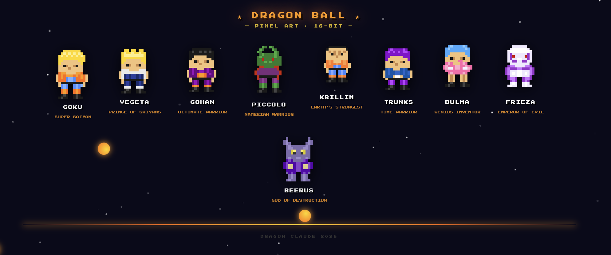
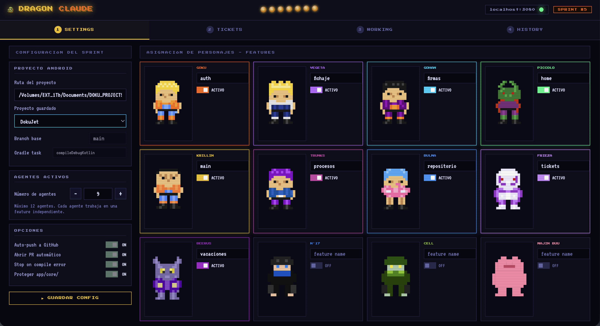
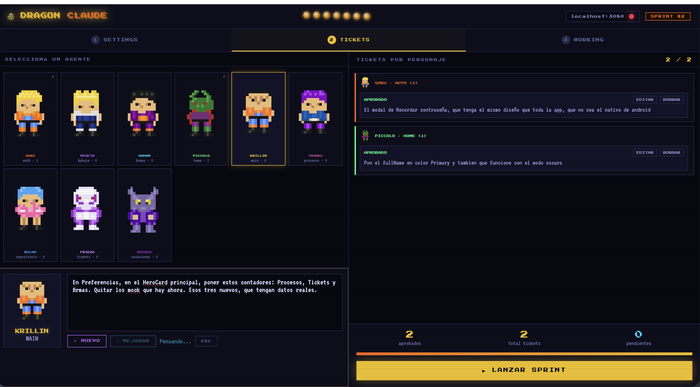
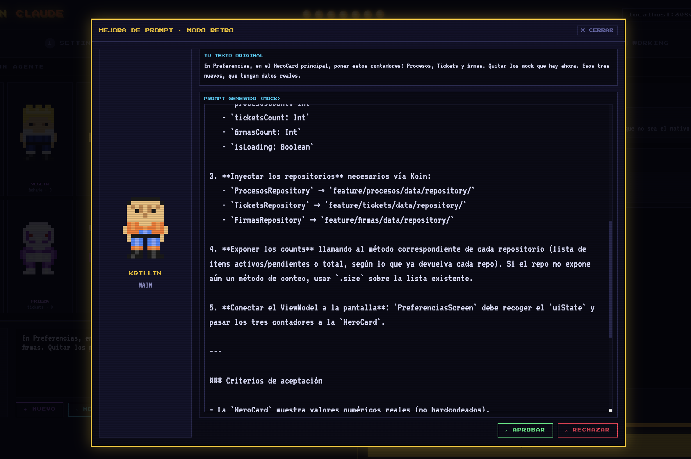
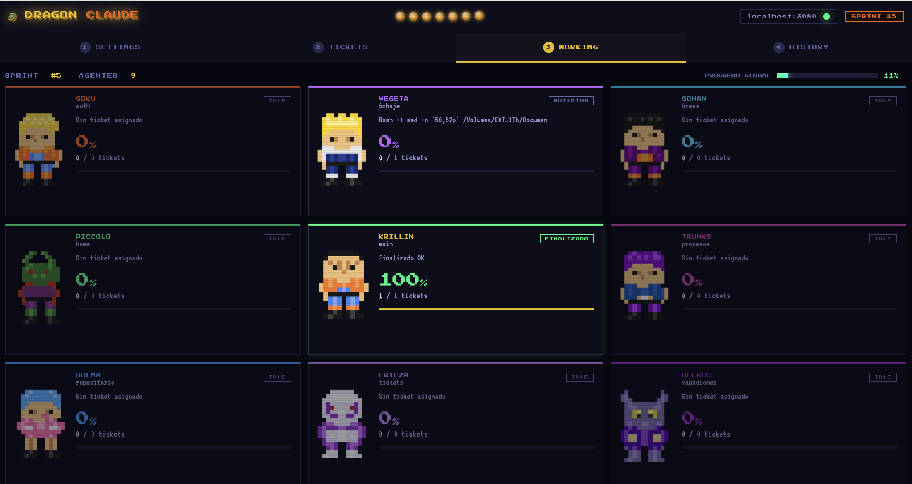

# Dragon Claude



Dragon Claude es el orquestador definitivo para tu proyecto.
Asigna features a personajes de Dragon Ball, escribe tickets en lenguaje natural,
deja que Claude los mejore, apruébalos y lanza un ejército de agentes en paralelo.
Cada uno trabaja en su feature y reporta su progreso en tiempo real.

## Pantallas

### 1) Settings

Configuras ruta del proyecto, parámetros base del sprint y asignación de agentes/features.



### 2) Tickets

Redactas tickets por agente, mejoras con `⚡ MEJORAR`, apruebas y preparas el sprint.



### 3) Prompt 

Vista de soporte para prompts y contexto del sprint ejecutado.



### 4) Working

Seguimiento en vivo del trabajo por agente: estado, tarea actual y progreso por tickets.



## Requisitos

- Node.js 18+
- Claude Code instalado y autenticado (`claude --version`)
- Subagentes/agents disponibles en Claude para el proyecto (por ejemplo `auth-agent`, `guardian-agent`, etc.)

## Estructura recomendada del proyecto objetivo (importante)

Para que el flujo de **features con agentes** funcione bien, el proyecto que vas a orquestar debe estar organizado en modo **Package by Feature**.

Esto permite definir dominios claros por agente (por ejemplo `feature/auth/`, `feature/payments/`, etc.), reducir solapamientos y evitar conflictos al trabajar en paralelo.

Si el proyecto está en modo **Package by Layer** (por capas técnicas globales como `ui/`, `data/`, `domain/` compartidas para todo), la separación por feature se vuelve ambigua y aumenta el riesgo de choques entre agentes.

## Dónde configurar Agentes, Claude y Skills

- Los **agentes de Claude** se definen como subagentes y se usan por nombre en Dragon Claude (por ejemplo `auth-agent`, `guardian-agent`).
- La coordinación de cambios compartidos entre agentes se gestiona en `.claude/tasks/shared-queue.md` (dentro del proyecto objetivo).
- Añadir **skills** en Claude también es recomendable para tareas repetitivas o especializadas (arquitectura, testing, refactor, documentación).

## Agentes Claude (ejemplo)

### `auth-agent`

```md
---
name: auth-agent
description: Módulo de auth de DokuJet. Todo lo de feature/auth/.
tools: Read, Write, Bash
---

Tu dominio: `feature/auth/`
Puedes crear, modificar y eliminar cualquier archivo dentro de tu dominio libremente.
Stack: Kotlin, Compose, Koin, Retrofit 3, kotlinx-serialization, Material3
Navegación: manual con `remember { mutableStateOf }`, sin Navigation Component
Para cambios en `di/AppModule.kt` o `core/`: solicítalo en `.claude/tasks/shared-queue.md`
```

### `guardian-agent`

```md
---
name: guardian-agent
description: Guardián de archivos compartidos de DokuJet. Usar para modificar di/AppModule.kt, core/, build.gradle, MainActivity.kt o DokuJetApplication.kt. Procesa peticiones de .claude/tasks/shared-queue.md.
tools: Read, Write, Bash
---

Tu dominio: `di/AppModule.kt`, `core/`, `build.gradle`, `MainActivity.kt`, `DokuJetApplication.kt`
Puedes crear, modificar y eliminar cualquier archivo dentro de tu dominio libremente.
Stack: Kotlin, Compose, Koin 4, Retrofit 3, kotlinx-serialization, Material3

## Protocolo
1. Lee `.claude/tasks/shared-queue.md` y procesa entradas PENDIENTE
2. Aplica cambios de forma **aditiva** — nunca elimines ni modifiques lo existente
3. Verifica con `./gradlew assembleDebug`
4. Actualiza el estado en shared-queue.md a COMPLETADO o ERROR
```

### Plantilla shared-queue

Añadir el archivo a ./claude/tasks/shared-queue.md

Ruta:

`/docs/tasks/shared-queue.md`

## Instalación

```bash
cd dragon-claude
npm install
```

## Ejecutar

```bash
node server.js
```

Abrir en navegador:

```text
http://localhost:3080
```

Healthcheck:

```text
http://localhost:3080/health
```

WebSocket (estado en vivo de agentes):

```text
ws://localhost:3081
```

## Atajos de arranque incluidos

Los scripts ya están dentro del proyecto en `scripts/` y esperan a que `/health` responda antes de abrir el navegador.

Nota sobre ruta del proyecto:
- Si ejecutas los scripts desde este repo, no tienes que cambiar nada.
- Si copias los scripts fuera del repo, cambia `PROJECT_PATH` (macOS) o `$projectPath` (Windows).

### macOS

```bash
./scripts/kame-kame.sh
```

Opcional: puedes llamarlo desde la app Atajos de macOS con una acción "Ejecutar script de shell".

### Windows (PowerShell)

```powershell
powershell -ExecutionPolicy Bypass -File .\scripts\kame-kame.ps1
```

### Permisos y ejecución

macOS:

```bash
chmod +x ./scripts/kame-kame.sh
./scripts/kame-kame.sh
```

Windows (PowerShell):

```powershell
Set-ExecutionPolicy -Scope CurrentUser RemoteSigned
Unblock-File .\scripts\kame-kame.ps1
powershell -ExecutionPolicy Bypass -File .\scripts\kame-kame.ps1
```

## Qué hace

1. Configuras la ruta del proyecto objetivo y agentes en **SETTINGS**.
2. Escribes tickets por agente en **TICKETS**.
3. `⚡ MEJORAR` refina el texto de cada tarea y genera un prompt de Claude adaptado al proyecto; cuando lo apruebas, queda añadido a la lista del sprint.
4. `▶ LANZAR SPRINT` ejecuta los tickets aprobados y puedes ver en **WORKING** el progreso en vivo de cada agente.
5. Al finalizar, consulta en **HISTORY** el historial de tickets ejecutados y su resultado.

## Persistencia de datos

Se guarda por proyecto en:

```text
projects/<nombre-proyecto>/
```

Archivos:

- `settings.json`: configuración activa + cola actual de tickets pendientes/no ejecutados.
- `ticket-history.log`: historial append-only de tickets lanzados (sin prompt mejorado).

Formato del historial (`ticket-history.log`): 1 JSON por línea, con campos como `date`, `feature`, `ticket`, `agentId`, `agentName`, `sprint`.

## Estructura

```text
dragon-claude/
├── README.md
├── .gitignore
├── public/
│   ├── index.html
│   ├── js/
│   │   ├── app.js
│   │   └── sprites.js
│   ├── styles/
│   │   ├── base.css
│   │   ├── settings.css
│   │   ├── tickets.css
│   │   └── working.css
├── docs/
│   ├── images/
│   │   ├── dragon-claude.png
│   │   ├── prompt.png
│   │   ├── settings.png
│   │   ├── tickets.png
│   │   └── working.png
│   └── tasks/
│       └── shared-queue.md
├── scripts/
│   ├── kame-kame.sh
│   └── kame-kame.ps1
├── projects/
│   └── <nombre-proyecto>/
│       ├── settings.json
│       └── ticket-history.log
├── package.json
├── package-lock.json
└── server.js
```


## Endpoints backend

- `GET /projects` → lista proyectos con `settings.json`
- `GET /settings?projectPath=...` → carga configuración de un proyecto
- `POST /settings` → guarda configuración/cola activa
- `POST /improve` → mejora ticket ejecutando Claude en la ruta del proyecto
- `POST /archive-tickets` → archiva tickets ejecutados en `ticket-history.log`
- `GET /health` → estado del servidor

## Logs del servidor

`server.js` imprime trazas útiles, por ejemplo:

- carga/guardado de settings con ruta de archivo
- mejora de ticket (proyecto/feature/resumen)
- archivado de tickets lanzados
