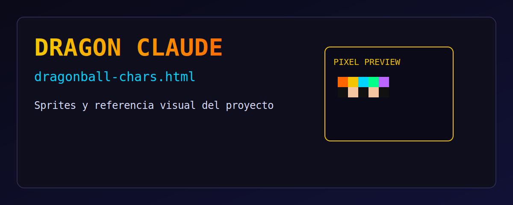

# Dragon Claude



[Abrir `dragonball-chars.html`](./dragonball-chars.html)

Orquestador visual de agentes para trabajar tickets Android con Claude, aprobarlos y lanzarlos por sprint.

## Requisitos

- Node.js 18+
- Claude Code instalado y autenticado (`claude --version`)

## Instalación

```bash
cd dragon-claude
npm install
```

## Ejecutar

```bash
node server.js
```

Abrir en navegador:

```text
http://localhost:3080
```

Healthcheck:

```text
http://localhost:3080/health
```

WebSocket (estado en vivo de agentes):

```text
ws://localhost:3081
```

## Qué hace

1. Configuras proyecto/branch/task/opciones/agentes en **Settings**.
2. Escribes tickets por agente en **Tickets**.
3. `⚡ MEJORAR` llama al backend (`/improve`) y ejecuta `claude --print`.
4. Apruebas tickets.
5. `▶ LANZAR SPRINT` archiva tickets aprobados y limpia la cola activa.

## Persistencia de datos

Se guarda por proyecto en:

```text
projects/<nombre-proyecto>/
```

Archivos:

- `settings.json`: configuración activa + cola actual de tickets pendientes/no ejecutados.
- `ticket-history.log`: historial append-only de tickets lanzados (sin prompt mejorado).

Formato del historial (`ticket-history.log`): 1 JSON por línea, con campos como `date`, `feature`, `ticket`, `agentId`, `agentName`, `sprint`.

## Estructura

```text
dragon-claude/
├── server.js
├── package.json
├── public/
│   ├── index.html
│   ├── styles/
│   │   ├── base.css
│   │   ├── settings.css
│   │   ├── tickets.css
│   │   └── working.css
│   └── js/
│       ├── sprites.js
│       └── app.js
├── projects/
│   └── <nombre-proyecto>/
│       ├── settings.json
│       └── ticket-history.log
└── dragonball-chars.html
```

`dragonball-chars.html` se mantiene en el repo como referencia de sprites.

## Endpoints backend

- `GET /projects` → lista proyectos con `settings.json`
- `GET /settings?projectPath=...` → carga configuración de un proyecto
- `POST /settings` → guarda configuración/cola activa
- `POST /improve` → mejora ticket ejecutando Claude en la ruta del proyecto
- `POST /archive-tickets` → archiva tickets ejecutados en `ticket-history.log`
- `GET /health` → estado del servidor

## Logs del servidor

`server.js` imprime trazas útiles, por ejemplo:

- carga/guardado de settings con ruta de archivo
- mejora de ticket (proyecto/feature/resumen)
- archivado de tickets lanzados
