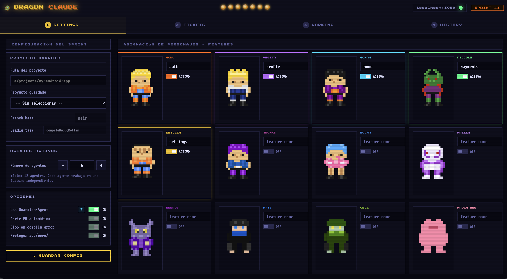
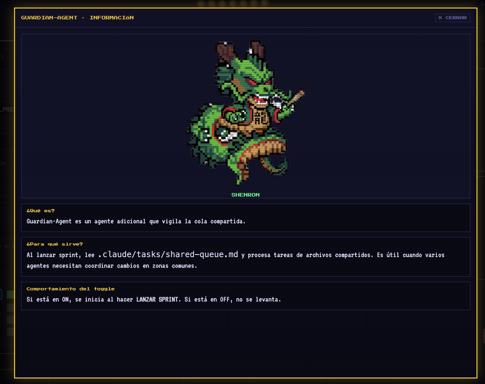

# Dragon Claude


Dragon Claude es un orquestador visual para lanzar sprints con subagentes de Claude Code sobre un proyecto real. Detecta features, asigna personajes, mejora tickets en lenguaje natural, abre sesiones en paralelo y muestra el progreso en vivo.

## Qué hace ahora

- Gestiona múltiples proyectos guardados desde la propia UI.
- Analiza la ruta de un proyecto y detecta plataforma y estructura por features.
- Puede generar automáticamente agentes en `.claude/agents/` para features nuevas.
- Mejora tickets con Claude y muestra uso de tokens/coste de cada `/improve`.
- Lanza un sprint con agentes por feature y con `guardian-agent` siempre activo.
- Sigue el estado en tiempo real vía WebSocket y parsea tags `TICKET_START`, `TICKET_OK` y `TICKET_FAIL`.
- Guarda historial por sprint, incluyendo uso de tokens del agente y opción de recuperar tickets no ejecutados.

## Pantallas

### 1) Settings

Desde aquí:

- creas un proyecto nuevo
- seleccionas un proyecto ya guardado
- ves su ruta y plataforma
- ajustas cuántos agentes activos participan
- asignas personaje ↔ feature

El flujo de `NUEVO PROYECTO` puede:

- detectar automáticamente la plataforma
- inspeccionar si el repo está organizado por features
- sugerir una ruta manual si no encuentra features
- marcar qué features ya tienen agente
- generar nuevos `.claude/agents/*.md`

`guardian-agent` ya no es opcional: se lanza siempre como SHENRON para vigilar `.claude/tasks/shared-queue.md`.




### 2) Tickets

Redactas tickets por agente, los mejoras con `⚡ MEJORAR`, revisas el prompt generado, ves métricas de uso (`IN`, `OUT`, `CACHE`, `COST`) y apruebas los que entrarán al sprint.


### 3) Working

Muestra el seguimiento en vivo del sprint:

- estado por agente
- tarea actual
- progreso global
- errores con motivo cuando un ticket falla
- card dedicada para SHENRON


### 4) History

Agrupa ejecuciones por sprint y por agente. Cada ticket archivado puede mostrar:

- texto original o mejorado
- uso de tokens del `/improve`
- uso de tokens del agente al completar el ticket
- acumulado del Guardian por sprint
- botón `RECUPERAR` para volver a la cola tickets históricos todavía no completados

## Requisitos

- Node.js 18+
- Claude Code instalado y autenticado
- macOS para `▶ LANZAR SPRINT` desde Terminal (`osascript`)

Comprobación rápida:

```bash
claude --version
node --version
```

## Requisito importante del proyecto objetivo

Dragon Claude espera un proyecto organizado por features o módulos funcionales.

Ejemplos válidos:

- `features/auth`
- `feature/payments`
- `modules/profile`

Si detecta una estructura por capas globales (`ui/`, `data/`, `domain/`, `repository/`, etc.) el análisis bloquea el onboarding porque aumenta mucho el riesgo de conflictos entre agentes.

## Dónde vive la configuración

Por cada proyecto se guarda una carpeta en:

```text
projects/<nombre-proyecto>/
```

Archivos:

- `settings.json`: configuración activa, agentes, tickets pendientes y siguiente sprint
- `ticket-history.log`: historial append-only con lanzamientos, completados y uso del Guardian

Además, dentro del proyecto objetivo Dragon Claude usa:

- `.claude/agents/` para los subagentes de feature y `guardian-agent`
- `.claude/tasks/shared-queue.md` para coordinación de cambios compartidos

Referencia de plantilla:

- `docs/tasks/shared-queue.md`

## Protocolo de tracking

Los agentes de feature deben emitir estos tags como texto plano:

```text
[TICKET_START]nombre exacto[/TICKET_START]
[TICKET_OK]nombre exacto[/TICKET_OK]
[TICKET_FAIL]nombre exacto[/TICKET_FAIL][FAIL]motivo[/FAIL]
```

Dragon Claude parsea esos tags desde la salida JSONL de Claude Code para:

- actualizar WORKING en tiempo real
- calcular progreso por tickets
- detectar fallos
- registrar uso por ticket en el historial

`guardian-agent` no usa estos tags; solo vigila la cola compartida y acumula sus métricas por sprint.

## Instalación

```bash
cd dragon-claude
npm install
```

## Ejecutar

```bash
npm start
```

Abrir en navegador:

```text
http://localhost:3080
```

Healthcheck:

```text
http://localhost:3080/health
```

WebSocket:

```text
ws://localhost:3081
```

## Flujo recomendado

1. Crea o selecciona un proyecto en `SETTINGS`.
2. Analiza el repo y confirma la plataforma/features detectadas.
3. Genera agentes nuevos si faltan.
4. Ajusta la asignación personaje ↔ feature.
5. Escribe tickets en `TICKETS`.
6. Usa `⚡ MEJORAR`, revisa el resultado y aprueba los tickets válidos.
7. Lanza el sprint.
8. Sigue el progreso en `WORKING`.
9. Consulta `HISTORY` para revisar costes, tokens y recuperar tickets antiguos.

## Scripts de arranque

Los scripts de `scripts/` esperan a que `/health` responda antes de abrir el navegador.

### macOS

```bash
chmod +x ./scripts/kame-kame.sh
./scripts/kame-kame.sh
```

### Windows

```powershell
powershell -ExecutionPolicy Bypass -File .\scripts\kame-kame.ps1
```

Nota:

- La UI puede abrirse en cualquier entorno donde corra Node.
- El lanzamiento real del sprint desde la app está implementado para macOS porque usa `osascript` para abrir sesiones de Terminal.

## Estructura del repo

```text
dragon-claude/
├── README.md
├── docs/
│   ├── images/
│   └── tasks/
├── projects/
│   └── <nombre-proyecto>/
├── public/
│   ├── index.html
│   ├── js/
│   ├── styles/
│   └── images/
├── scripts/
├── package.json
└── server.js
```

## Endpoints backend

- `GET /projects` lista proyectos guardados
- `GET /settings?projectPath=...` carga la configuración de un proyecto
- `POST /settings` guarda configuración, agentes y cola de tickets
- `GET /history?projectPath=...` devuelve historial enriquecido con usage por ticket y por guardian
- `POST /launch` lanza agentes y guardian en Terminal
- `POST /improve` mejora un ticket con Claude y devuelve texto + usage
- `DELETE /project` borra la configuración persistida de un proyecto
- `POST /analyze-project` detecta plataforma, estructura y features
- `POST /generate-agents` crea agentes de feature y `guardian-agent`
- `GET /health` estado del servidor

## Logs útiles

`server.js` deja trazas para:

- carga y guardado de settings
- lanzamiento de agentes
- parseo de sesiones
- mejoras de tickets
- generación de agentes
- análisis de proyecto
- borrado de proyectos
